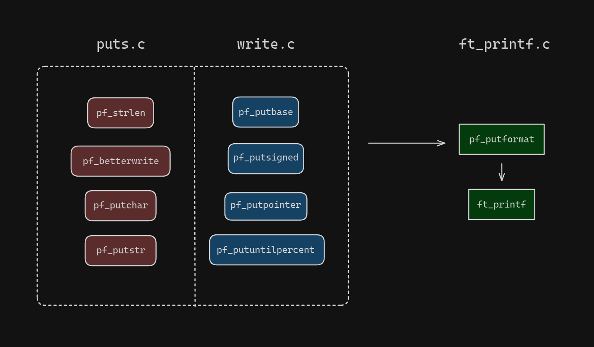
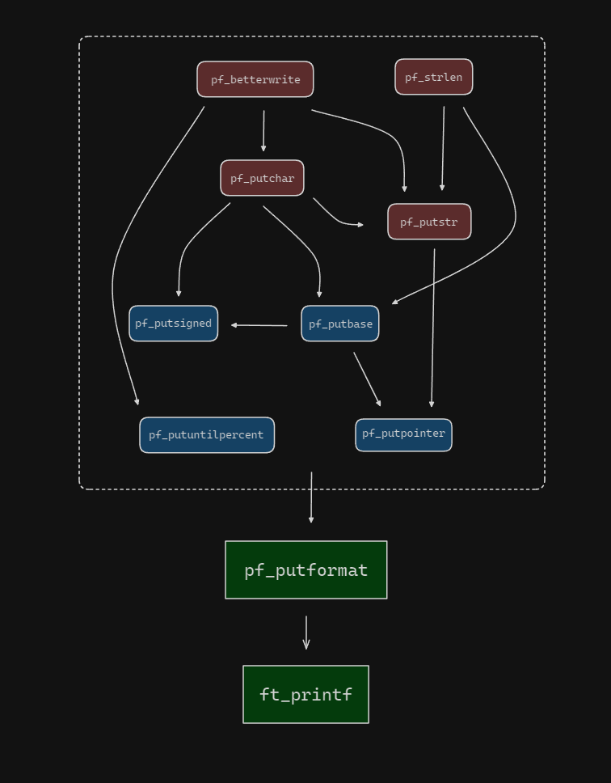

		██████╗ ██████╗ ██╗███╗   ██╗████████╗███████╗
		██╔══██╗██╔══██╗██║████╗  ██║╚══██╔══╝██╔════╝
		██████╔╝██████╔╝██║██╔██╗ ██║   ██║   █████╗  
		██╔═══╝ ██╔══██╗██║██║╚██╗██║   ██║   ██╔══╝  
		██║     ██║  ██║██║██║ ╚████║   ██║   ██║     
		╚═╝     ╚═╝  ╚═╝╚═╝╚═╝  ╚═══╝   ╚═╝   ╚═╝     

---

# printf

 This project contains the implementation of the ft_printf function,
 which is a custom implementation of the printf function in C.
 It provides a way to format and print output to the console.

## Functions

<p align="center">
  
</p>

<p align="center">
  
</p>

 ## Usage:
 1. Include the "ft_printf.h" header file in your source code.
 2. Call the ft_printf function with the desired format string andrguments.
 3. The function will format the output according to the format stringnd print it to the console.

 Example:
 ```BASH
 ft_printf("Hello, %s!\n", "world");
 ```
 Output:
 ```BASH
 Hello, world!
 ```